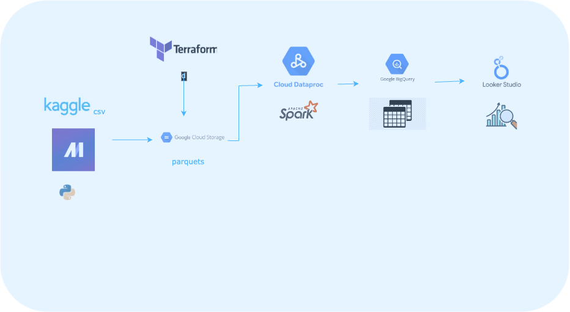

# Financial Fraud Analysis using Synthetic data 

## Overview
In this project, we show the data engineering pipeline, from data ingestion using . This project is a capstone for the fulfilment of the [data engineering zoomcamp](https://github.com/DataTalksClub/data-engineering-zoomcamp.git).

## Table of Contents
- [Background](#background)
- [Dataset](#dataset)
- [Objectives](#obectives)
- [Visualization](#visualization)
- [Setup](#setup)
- [Acknowledgment](#acknowledgment)

## Background
In the rapidly evolving landscape of financial transactions, the rise of sophisticated fraudulent activities poses a significant threat to the integrity and stability of financial institutions. Despite the implementation of traditional fraud detection methods, such as rule-based systems and manual audits, the detection and prevention of fraudulent activities remain challenging. Financial institutions face substantial financial losses, reputational damage, and regulatory penalties due to undetected fraudulent transactions.

To address these challenges, there is a critical need for an advanced financial fraud detection system that leverages data engineering principles and machine learning algorithms. The system should be capable of analyzing large volumes of transactional data in real-time to identify anomalous patterns indicative of fraudulent behavior. By implementing such a system, financial institutions can proactively detect and prevent fraudulent activities, safeguarding their assets and maintaining trust with customers.

The aim of this project is to develop a comprehensive data engineering pipeline tailored to the specific needs of ingesting data into a cloud storage solution, orchestrating data workflows using an orchestrator (Mage), and subsequently loading the processed data into a data warehouse. By establishing an efficient and scalable data engineering pipeline, organizations can streamline the data ingestion process, enhance data accessibility, and lay the foundation for downstream analytics and machine learning initiatives.

Given the project's emphasis on data engineering, there is no inclusion of a machine learning process. Nonetheless, the data derived from the table undergoes visualization. 

## Dataset
The dataset is the synthetic financial dataset for fraud detection available [here](https://www.kaggle.com/datasets/ealaxi/paysim1/data)

## Objectives

This project focuses on building a robust data engineering pipeline for efficient data ingestion, orchestration, warehousing, and visualization. Below are the key components of the project:

- **Infrastructure Provisioning**: Implementation of infrastructure provisioning using Terraform to automate the deployment of cloud resources required for the data engineering pipeline.

- **Streamlined Data Ingestion**: Implementation of efficient mechanisms to ingest data from diverse sources into a centralized cloud storage solution, ensuring seamless data availability and accessibility.

- **Automated Data Orchestration**: Utilization of automated workflows orchestrated by Mage to schedule, monitor, and manage data ingestion tasks, thereby minimizing manual intervention and optimizing operational efficiency.

- **Scalable Data Warehousing**: Configuration of a scalable and high-performance data warehouse infrastructure capable of accommodating the expanding volume and variety of data ingested from multiple sources.

- **Enhanced Data Quality**: Integration of data quality checks and validation processes to uphold the integrity and reliability of data across the data engineering pipeline, ensuring accurate and consistent data outputs.

- **Insightful Data Visualization**: Integration of Looker Studio to visualize and analyze data stored within the data warehouse, empowering stakeholders to derive actionable insights and facilitate data-driven decision-making processes.

## Visualization
From the generated table, a visualization of the table is made. I sought to answer the following questions:
- How many records are in the data i.e all transactions?
- How many records are fraud transactions?
- What is the percentage by type of all transactions?
- What type of transactions recorded the highest fraud instances?
- Given the new extracted data, what month recorded the highest frauds?

Final visualization can be found [here](https://lookerstudio.google.com/reporting/5da912e1-8240-4d4c-a25c-d5f0b7454233)

## Setup
To replicate this project, [go to](setup.md)

## Acknowledgment
I extend my heartfelt appreciation to Data Talks Club for organizing this Data Engineering Zoomcamp. The dedication and effort put into curating the comprehensive curriculum, engaging sessions, and valuable resources have truly enriched my learning experience.

The Data Engineering Zoomcamp provided me with a platform to delve deep into the intricacies of data engineering, explore cutting-edge technologies, and gain practical skills that are invaluable in today's data-driven world.

I express my sincere gratitude to the entire team at Data Talks Club for their commitment to fostering learning and growth within the data community. Your passion for sharing knowledge and fostering collaboration is commendable and has inspired me to continue my journey in the field of data engineering with enthusiasm and dedication, and also gain invaluable skills for my research.

My appreciation also goes to all the participants of the 2024 cohorts. Thank you for your unwavering support, guidance, and encouragement throughout the Data Engineering Zoomcamp. I look forward to continued collaboration and learning opportunities with Data Talks Club in the future.

